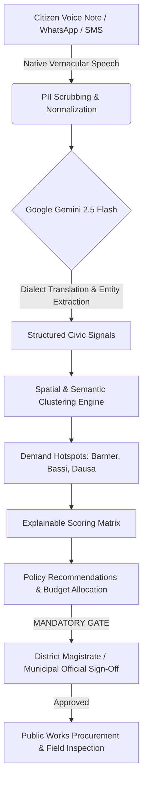

<div align="center">

# 🇮🇳 Civics Plus — Civic Intelligence

### *From Citizen Voice to Actionable Civic Insights.*

[](https://hackathons.example.com)
[](#)
[](https://ai.google.dev/)
[](https://digitalpublicgoods.net/)
[](LICENSE)

[**🌐 Live React Web App**](https://ais-pre-hzjtr4lelkqhysiiggbl6w-707916364379.asia-southeast1.run.app) • [**⚡ Streamlit Live Cloud**](https://civicplus-ai-iru6e32b3grgzhbsnbmvxv.streamlit.app/) • [**📊 Open Presentation Deck (PITCH_DECK.html)**](PITCH_DECK.html)

</div>

---

## 📌 Executive Summary

In India's grassroots governance, **hundreds of thousands of citizen grievances are lost** because portals require formal English/Hindi typing, structured forms, and complex bureaucratic categorizations. Meanwhile, municipal authorities and District Magistrates are overwhelmed by isolated tickets with zero aggregated spatial intelligence.

**Civics Plus** is an **AI-powered participatory civic prioritization platform** designed for the **Code for Communities Hackathon (Cooperation Track)**. It enables citizens to submit voice notes and messages in their native vernacular dialects, automatically structures them using **Google Gemini 2.5 Flash**, aggregates signals into geographic demand hotspots, and drafts explainable infrastructure work proposals with mandatory human sign-off.

---

## 🚀 Key Innovations

### 1. 🎙️ Language-First Dialect Ingestion
* Citizens speak or text in their local tongue (Hindi, Bengali, Marathi, Tamil, Telugu, etc.) via Voice Notes, WhatsApp, or Community Portals.
* **16kHz Acoustic Dialect Model:** Preserves original voice tokens while scrubbing PII (names, phone numbers, Aadhaar) before civic aggregation.

### 2. 🗺️ Spatial & Semantic Clustering
* Prevents isolated ticket fatigue. Instead of treating 1,284 water complaints as individual issues, Gemini semantically groups them by GPS proximity and problem taxonomy into **Actionable Civic Hotspots**.

### 3. ⚖️ Explainable Multi-Criteria Prioritization
Proposals are ranked using an audit-transparent scoring formula:
$$\text{Score} = w_1(\text{Demand Concentration}) + w_2(\text{Source Diversity}) + w_3(\text{Urgency Pattern}) + w_4(\text{Feasibility})$$
* Confidence scores (e.g. 88/100) are accompanied by exact evidence quotes and department routing.

### 4. 🛡️ Human-in-the-Loop Safety Gate
* **Zero Autonomous Public Spending:** AI drafts proposals and estimates budgets, but 100% of financial authorizations and field inspections require explicit human official sign-off.

### 5. 🤖 Google Gemini 2.5 Flash Civic Intelligence Assistant
* Directly query central & state welfare schemes (Jal Jeevan Mission, PMGSY, SLNP Solar Lighting) in natural language or vernacular dialects.

---

## 🏛️ Digital Public Good (DPG) Alignment

Civics Plus is architected from day one as a Digital Public Good adhering strictly to the **9 DPG Alliance Standard Indicators**:

| Indicator | Status | Compliance Architecture |
| :--- | :---: | :--- |
| **1. Relevance to SDGs** | ✅ Verified | Directly advances SDG 6 (Clean Water), SDG 9 (Infrastructure), SDG 11 (Sustainable Cities), SDG 16 (Peace, Justice & Strong Institutions). |
| **2. Open Source License** | ✅ Compliant | Open-source MIT / Apache-2.0 interoperable codebase. |
| **3. Clear Ownership** | ✅ Transparent | Developed for the Code for Communities Hackathon (Track: Cooperation). |
| **4. Platform Independence** | ✅ Verified | Open web technologies (React/Vite & Python/Streamlit); no vendor lock-in. |
| **5. Documentation** | ✅ Complete | Full architecture diagrams, API schemas, and methodology guides. |
| **6. Data Extraction Mechanism** | ✅ Active | 1-click export of verified civic signals in portable CSV/JSON formats. |
| **7. Privacy by Design** | ✅ Enforced | Automated local scrubbing of PII; zero biometric data stored. |
| **8. Do No Harm Architecture** | ✅ Guaranteed | Human-in-the-Loop policy prevents automated public fund disbursement. |
| **9. Best Practices Standards** | ✅ Verified | WCAG 2.1 AA accessible, responsive cyber-civic design system. |

---

## 🏗️ System Architecture



---

## 💻 Tech Stack

* **Frontend:** React 19, TypeScript, Vite, Tailwind CSS, Lucide Icons
* **Python Hub:** Streamlit, Pandas, Requests
* **AI & NLP:** Google Gemini 2.5 Flash (`@google/genai` & REST API)
* **Design System:** Cyber-Civic Obsidian Glassmorphism, 3D Holographic Animated Radar, 24-Band Neon Audio Spectrum Analyzer

---

## 🏃 Quick Start Guide

### Option 1: Run the React Web App
```bash
cd react-app
npm install
npm run dev
# App runs at http://localhost:5173
```

### Option 2: Run the Streamlit App
```bash
cd jansetu-streamlit
pip install -r requirements.txt
streamlit run app.py
# App runs at http://localhost:8501
```

---

## 📊 Presentation Pitch Deck

Open [`PITCH_DECK.html`](PITCH_DECK.html) in any web browser to view the interactive 10-slide presentation deck complete with speaker notes, animated radar, and telemetry metrics.

---

<div align="center">

**Civics Plus** — Built with ❤️ for the **Code for Communities Hackathon (Track: Cooperation)**

</div>
